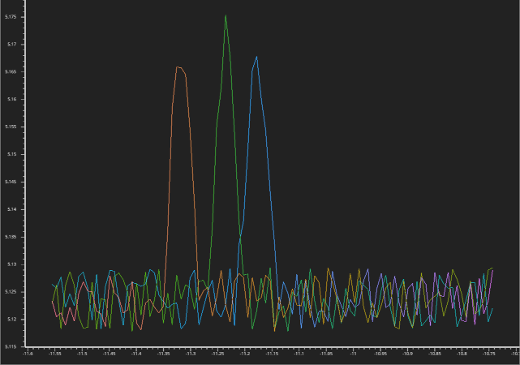
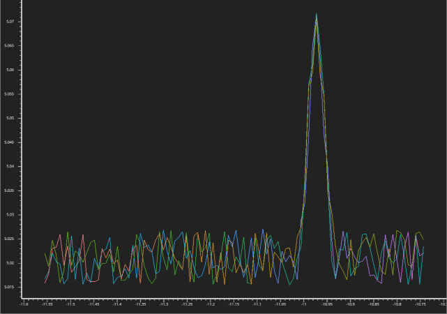

Synchronization
===============

In this script we will demonstrate how to use lascar to perform leakage
synchronisation.

In side-channel, leakages need to be slightly "stackable". It is very common
that, from a trace to another, physical behaviors induce temporal shifting in
the leakage.

Leakage synchronization is the name given to the post-processing method you
apply on it to make all leakages "stackable", or aligned.

In the following example we will design an
:class:`AbstractContainer <lascar.container.container.AbstractContainer>` that
will generate fake "desynchronized" traces. We will then design a
synchronization method, which will consist in a
:attr:`leakage_processing <lascar.container.container.Container>`
applied to the
:class:`AbstractContainer <lascar.container.container.AbstractContainer>`, so
that it will deliver synchronized traces.

.. code-block:: python

   from lascar import AbstractContainer, Trace
   import numpy as np

   # First the SimulatedContainer, on which we will set up the synchronisation:
   class SimulatedContainer(AbstractContainer):
       def generate_trace(self, idx: int):
           # Our leakage will consist in 100 time samples, with a peak randomly
           # inserted. Imagine this peak contains the side-channel information.
           leakage = np.random.rand(100)
           # The offset where the peak will be inserted
           offset = np.random.randint(20, 80)
           leakage[offset : offset + 11] += np.hanning(11) * 4
           value = np.zeros(())  # the value wont be used in here...
           return Trace(leakage, value)

Lets create a container with 100 generated traces. We can use the
:meth:`plot_leakage <lascar.container.container.Container.plot_leakage>` method
to display the first traces, and note that the leakages are not stackable, as
expected.

.. code-block:: python

   container = SimulatedContainer(100)
   container.plot_leakage(range(3))

   Non aligned traces

Now the synchronisation process.
:attr:`leakage_procesing <lascar.container.container.Container.leakage_processing>`
will be used, so we need to design a function, that takes a leakage as input and
returns a transformed leakage.

Actually, we won't use a function, but a
`callable class <https://docs.python.org/3/glossary.html#term-callable>`_. The
reason why we do that, is that our synchronisation process will attempt to
overlay leakages based on a reference trace leakage.

The synchronisation strategy will find the peak in each trace (
`argmax <https://numpy.org/doc/stable/reference/generated/numpy.argmax.html>`_
in this case) and roll the leakages to match the first peak.

Another more sound strategy would have been to shift the leakage until we
minimize the distance between leakages, but the soundness of the synchronisation
is not the point here.

.. code-block:: python

   class Synchronisation:
       def __init__(self, leakage_ref):
           self.ref_offset = leakage_ref.argmax()

       def __call__(self, leakage):
           # We need to find the peak in each leakage, and roll it to match the ref_peak
           peak_offset = leakage.argmax()
           return np.roll(leakage, self.ref_offset - peak_offset)

   Aligned traces

Now we can instantiate a :class:`Synchronisation`, using the leakage of the
first trace as a reference. As seen in the first tutorial, we just have to set
the container
:attr:`leakage_processing <lascar.container.container.Container.leakage_processing>`
attribute:

.. code-block:: python

   ref_leakage = container[0].leakage
   container.leakage_processing = Synchronisation(ref_leakage)
   container.plot_leakage(range(3))
  
This will also plot the leakages, to realize that they have been transformed,
and should match more.

Don't forget that you always have the possibility to store your synchronized
traces on disk:

.. code-block:: python

   from lascar import Hdf5Container

   hdf5_container = Hdf5Container.export(container, "tmp.h5")

