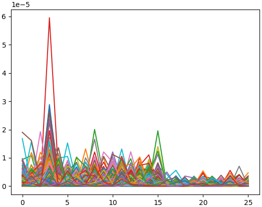

Differential Power Analysis example
===================================

Based on what's introducted in the previous pages, this tutorial will now show
now to setup a classical
`Differential Power Attack (DPA) <https://www.paulkocher.com/doc/DifferentialPowerAnalysis.pdf>`_
using *Lascar*.

For that, a :class:`DpaEngine <lascar.engine.dpa_engine.DpaEngine>` is
instanciated and registered it to a :class:`Session <lascar.session.Session>`.

The folder
`lascar/examples/base <https://github.com/Ledger-Donjon/lascar/tree/master/examples/base>`_
contains examples for different kinds of side-channel attacks/characterization.

The traces used in this example will be simulated using the
:class:`BasicAesSimulationContainer <lascar.container.simulation_container.BasicAesSimulationContainer>`:

.. code-block:: python

   from lascar import BasicAesSimulationContainer

   container = BasicAesSimulationContainer(500, noise=1)

Then, there are three requirements for instanciating the
:class:`DpaEngine <lascar.engine.dpa_engine.DpaEngine>`:

- a name for the engine ("dpa" in our case),
- a selection function (under guess hypothesis): this function will separate
  the traces into two sets, depending on a hypothesis: "guess". This function
  will be applied on every trace values, for every possible guess.
- a guess range: what are the guesses you want to test?

In this example, we will focus on the LSB bit of the 3rd AES sbox. This value is
conditioned by a single key byte (256 guesses).

.. code-block:: python

   from lascar.tools.aes import sbox
   from lascar import DpaEngine

   def selection_function(value, guess):
       return sbox[value["plaintext"][3] ^ guess] & 1

   guess_range = range(256)
   dpa_engine = DpaEngine(selection_function, guess_range)

We can now create a :class:`Session <lascar.session.Session>`, register the
:code:`dpa_lsb_engine`, and run it:

.. code-block:: python

   from lascar import Session

   session = Session(container, engine=dpa_engine)
   session.run(batch_size=100)  # traces loaded by batches of 100
   
Note that the :meth:`Session.add_engine() <lascar.session.Session.add_engine>`
method can be used as well to register the engine to the session.

Finally, to get the result, one solution can be to request the
:meth:`dpa_lsb_engine.finalize() <lascar.engine.engine.Engine.finalize>`
method. As most of the engines, the
:meth:`finalize() <lascar.engine.engine.Engine.finalize>` method returns side-channels
analysis results. For more option about how to manage the results, please follow
the next step of the tutorial.

.. code-block:: python

   results = dpa_engine.finalize()
   print(results.shape)
   print("Best guess is %02X." % results.max(1).argmax())

   import matplotlib.pyplot as plt

   plt.plot(results.T)
   plt.show()

This will print the best guess and plot the measurements:

.. code-block:: text

    Session |100%|####|500 trc/500 | (3 engines, batch_size=100, leakage_shape=(26,)) |Time:  0:00:01
    (256, 26)
    Best guess is 03.

    Guesses correlation