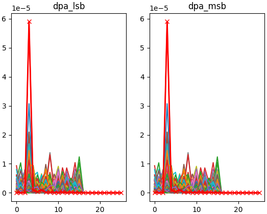
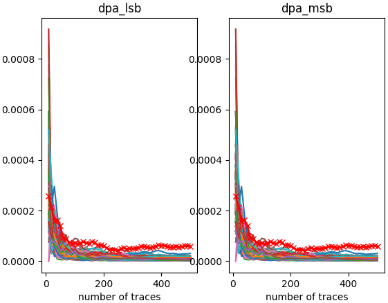
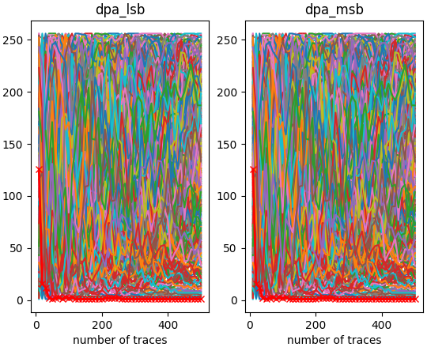

Session outputs
===============

In side-channel analysis, output management is a crucial final step.

During processing, a large amount of data is manipulated and many statistics are
computed. It must be decided which information can be extracted and what
measures should be presented:

- extract only the most substantial info (i.e. the secret key)?
- extract the info for all guesses?
- monitor the progression of the attack?
- visualize the results?
- write the results into a file?
- what kind of visualization?
- what kind of file format?

In Lascar, dealing with results is achieved using
:class:`OutputMethod <lascar.output.output_method.OutputMethod>`.
An :class:`OutputMethod <lascar.output.output_method.OutputMethod>` is an object
used by the :class:`Session <lascar.session.Session>` to define how the results
must be processed.

Also, the :code:`output_steps` parameter of the
:class:`Session <lascar.session.Session>` class can be used to indicate at which
number of traces the engine should compute their results.

Every time an engine has results to deliver (through the
:meth:`finalize() <lascar.engine.engine.Engine.finalize>` method), it goes by
the :class:`OutputMethod <lascar.output.output_method.OutputMethod>`.

*Lascar* already implements a few output methods that will be presented in this
tutorial (and in the
`lascar/examples <https://github.com/Ledger-Donjon/lascar/tree/master/examples>`_
folder):

- :class:`DictOutputMethod <lascar.output.pickle_output_method.DictOutputMethod>`:
  results are all stored inside a python dictionnary, with the possibility to
  save it using pickle.
- :class:`Hdf5OutputMethod <lascar.output.hdf5_output_method.Hdf5OutputMethod>`:
  results are stored inside a hdf5 file, all attacks are groups, and datasets
  for each output step.
- :class:`MatPlotLibOutputMethod <lascar.output.plot_output_method.MatPlotLibOutputMethod>`:
  results are displayed on a matplotlib plot, with parameters to indicate the
  layout (in case of multiple attacks).
- :class:`ScoreProgressionOutputMethod <lascar.output.plot_output_method.ScoreProgressionOutputMethod>`:
  results are parsed, and the best scores are extracted, and displayed in
  function of the number of trace.
- :class:`RankProgressionOutputMethod <lascar.output.plot_output_method.RankProgressionOutputMethod>`:
  results are parsed, and the rank of the best scores are extracted, and
  displayed in function of the number of trace.

The previous script of the DPA example tutorial, which runs on simulated AES
traces, is reused here. This time, two DPA are run in parallel: one on the LSB
of the output of the 3rd sbox, the other on the MSB.

.. code-block:: python

   from lascar import *
   from lascar.tools.aes import sbox

   container = BasicAesSimulationContainer(500, noise=0.01)
   guess_range = range(256)

   def selection_function_lsb(value, guess):
       return sbox[value["plaintext"][3] ^ guess] & 1

   def selection_function_msb(value, guess):
       return (sbox[value["plaintext"][3] ^ guess] >> 7) & 1

   dpa_lsb_engine = DpaEngine(
       "dpa_lsb", selection_function_lsb, guess_range, solution=container.key[3]
   )
   dpa_msb_engine = DpaEngine(
       "dpa_msb", selection_function_lsb, guess_range, solution=container.key[3]
   )

Dictionnary output
------------------

:class:`DictOutputMethod <lascar.output.pickle_output_method.DictOutputMethod>`
accepts any number of engine arguments. If a filename is specified, the results
are exported in pickle format.

.. code-block:: python

   dict_output_method = DictOutputMethod(dpa_lsb_engine, dpa_msb_engine)
   # If a filename is specified, DictOutputMethod will save them using pickle
   dict_output_method = DictOutputMethod(
       dpa_lsb_engine, dpa_msb_engine, filename="dict_output_method.pickle"
   )

   session = Session(
       container,
       engines=[dpa_lsb_engine, dpa_msb_engine],
       output_method=dict_output_method,
   ).run(batch_size=50)

Here :code:`dict_outut_method` has been updated. It contains the results of the
engines, which can be verified like this:

.. code-block:: python

   assert np.all(dict_output_method["dpa_lsb"] == dpa_lsb_engine.finalize())
   assert np.all(dict_output_method["dpa_msb"] == dpa_msb_engine.finalize())

Results have also been saved to an output pickle file:

.. code-block:: python

   assert np.all(
       DictOutputMethod.load("dict_output_method.pickle")["dpa_lsb"]
       == dpa_lsb_engine.finalize()
   )

Outputing intermediate results
------------------------------

To add multiple output steps during the analysis, the :code:`output_steps`
parameter can be issued as in the following example:

.. code-block:: python

   session = Session(
       container,
       engines=[dpa_lsb_engine, dpa_msb_engine],
       output_method=dict_output_method,
       output_steps=[10, 20, 50],
   ).run(batch_size=50)

With this feature, it possible to retrieve intermediate results using
indexing, such as:

.. code-block:: python

   dict_output_method["dpa_lsb"][10]  # Result for dpa_lsb after 10 traces
   dict_output_method["dpa_lsb"][20]  # Result for dpa_lsb after 20 traces
   dict_output_method["dpa_lsb"][50]  # Result for dpa_lsb after 50 traces

Exporting to a HDF5 file
------------------------

:class:`Hdf5OutputMethod <lascar.output.hdf5_output_method.Hdf5OutputMethod>`
is very similar to the
:class:`DictOutputMethod <lascar.output.pickle_output_method.DictOutputMethod>`.
With this class, the results are exported to a file in
`HDF5 <https://www.hdfgroup.org/HDF5/>`_ format. For each
:class:`DictOutputMethod <lascar.output.pickle_output_method.DictOutputMethod>`, the
output filename is mandatory here.

.. code-block:: python

   hdf5_output_method = Hdf5OutputMethod("hdf5_output.h5", dpa_lsb_engine, dpa_msb_engine)

   session = Session(
       container,
       engines=[dpa_lsb_engine, dpa_msb_engine],
       output_method=hdf5_output_method,
       output_steps=[10, 20, 50],
   ).run(batch_size=50)

`h5ls` can be used to inspect the content of the generated HDF5 output file. In
particular, we can observe that there is a dataset containing the results for the
intermediate steps:

.. code-block:: text
   
   $ h5ls -r hdf5_output.h5
   /                        Group
   /dpa_lsb                 Group
   /dpa_lsb/10              Dataset {256, 26}
   /dpa_lsb/20              Dataset {256, 26}
   /dpa_lsb/50              Dataset {256, 26}
   /dpa_lsb/500             Dataset {256, 26}
   /dpa_msb                 Group
   /dpa_msb/10              Dataset {256, 26}
   /dpa_msb/20              Dataset {256, 26}
   /dpa_msb/50              Dataset {256, 26}
   /dpa_msb/500             Dataset {256, 26}
   /mean                    Group
   /mean/10                 Dataset {26}
   /mean/20                 Dataset {26}
   /mean/50                 Dataset {26}
   /mean/500                Dataset {26}
   /var                     Group
   /var/10                  Dataset {26}
   /var/20                  Dataset {26}
   /var/50                  Dataset {26}
   /var/500                 Dataset {26}

.. note:: Note: To access a HDF5 dataset value, use :code:`.value` attribute

:class:`Hdf5OutputMethod <lascar.output.hdf5_output_method.Hdf5OutputMethod>`
has a static method to load results from a
`HDF5 <https://www.hdfgroup.org/HDF5/>`_ file.

.. code-block:: python
   
   hdf5_output_method_bis = Hdf5OutputMethod.load("hdf5_output.h5")
   assert np.all(hdf5_output_method_bis["dpa_lsb/500"][()] == dpa_lsb_engine.finalize())

The results can also be plotted using matplotlib, using
:class:`MatPlotLibOutputMethod <lascar.output.plot_output_method.MatPlotLibOutputMethod>`.
If a solution has been set to the :code:`dpa_engines`, the corresponding plot is
highlighted. The :code:`filename` parameter, which is optional, enables
exporting the figure to an image file.

.. code-block:: python

   mpl_output_method = MatPlotLibOutputMethod(
       dpa_lsb_engine, dpa_msb_engine, filename="foo.png"
   )
   session = Session(
       container, engines=[dpa_lsb_engine, dpa_msb_engine], output_method=mpl_output_method
   ).run(batch_size=50)

   DPA result plotted with matplotlib

Rank and score
--------------

:class:`ScoreProgressionOutputMethod <lascar.output.plot_output_method.ScoreProgressionOutputMethod>`
and
:class:`RankProgressionOutputMethod <lascar.output.plot_output_method.RankProgressionOutputMethod>`
can be used to plot the rank and score of a DPA analysis. The following example
shows how to monitor the progression of the scores of our 2 attacks, every 10
traces. You'll observe in particular that multiple output methods can be given
to a session:

.. code-block:: python

   score_progression_output_method = ScoreProgressionOutputMethod(
       dpa_lsb_engine, dpa_msb_engine
   )
   rank_progression_output_method = RankProgressionOutputMethod(
       dpa_lsb_engine, dpa_msb_engine
   )
   session = Session(
       container,
       engines=[dpa_lsb_engine, dpa_msb_engine],
       output_method=[score_progression_output_method, rank_progression_output_method],
       output_steps=10,
   ).run(batch_size=50)

   # Scores and steps can be accessed:
   score_progression_output_method.get_scores()
   score_progression_output_method.get_scores_solution()
   score_progression_output_method.get_steps()

   Score

   Rank